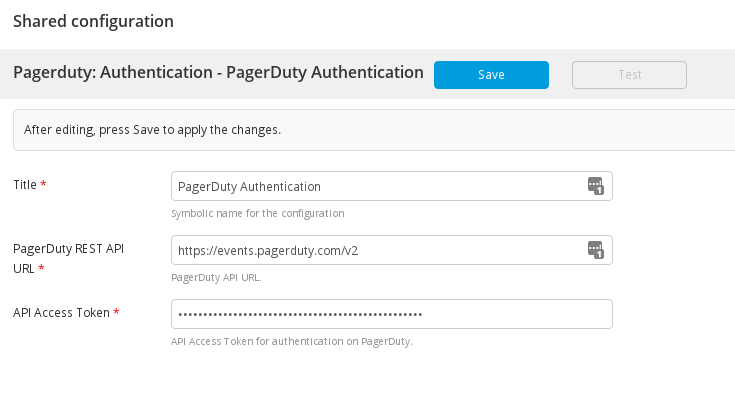
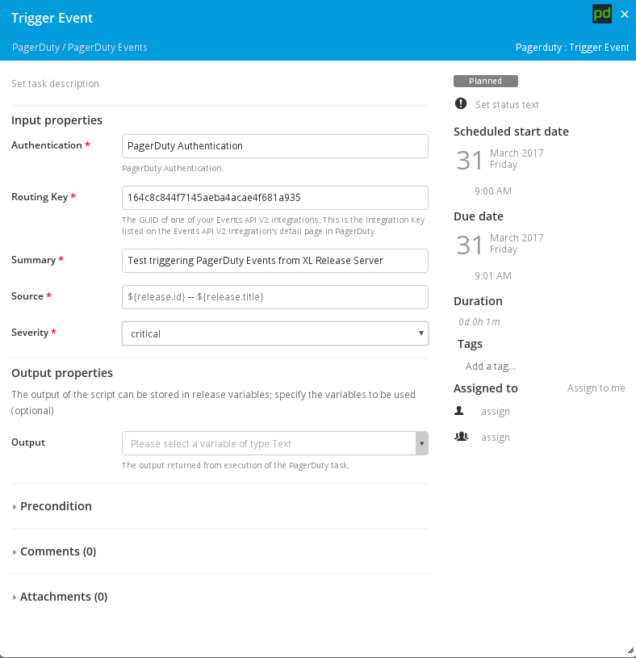

# XLR PagerDuty Plugin

## Preface
This document describes the functionality provided by the `xlr-pagerduty-plugin`

## Overview
This module offers a basic interface to PagerDuty functionality.

## Installation
Copy the plugin JAR file into the `SERVER_HOME/plugins` directory of XL Release.

## PagerDuty Authentication
Configures the credentials used to authenticate with the PagerDuty REST API. You should use the API Access Key configured in your PagerDuty account under "Configuration / API Access" menu. 

## Available Tasks
The available tasks for interfacing with PagerDuty. These tasks utilize the PagerDuty REST API and the provided PagerDuty Authentication Configuration.

### Trigger Event
Triggers Event to the specified Routing Key.

## Configuring PagerDuty For XL Release
The following steps show how to configure PagerDuty to work with XL Release through the PagerDuty Release API.

* Create a team.
* Add users to your team.
* Have users set up their notification rules.
* Create an Escalation Policy and associate it with your team.
* Create a Service
    * Select "Use our API directly"
    * Events API v2
    * Choose Escalation Policy you created previously.
* Copy the Integration Key from the "Integrations" tab of your newly created service, it is needed to configure triggering events.

--- 

## References:
* [PagerDuty REST API](https://v2.developer.pagerduty.com/docs/)
